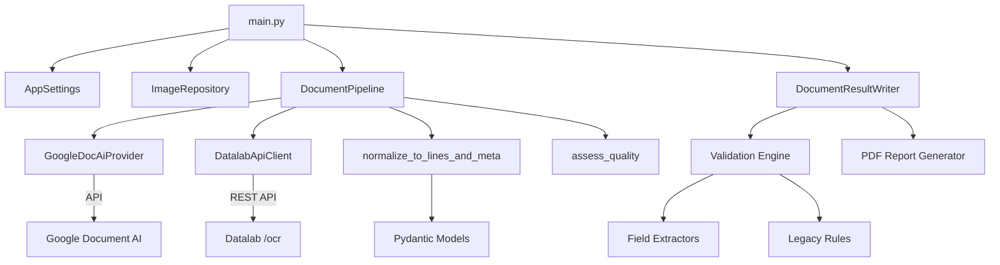
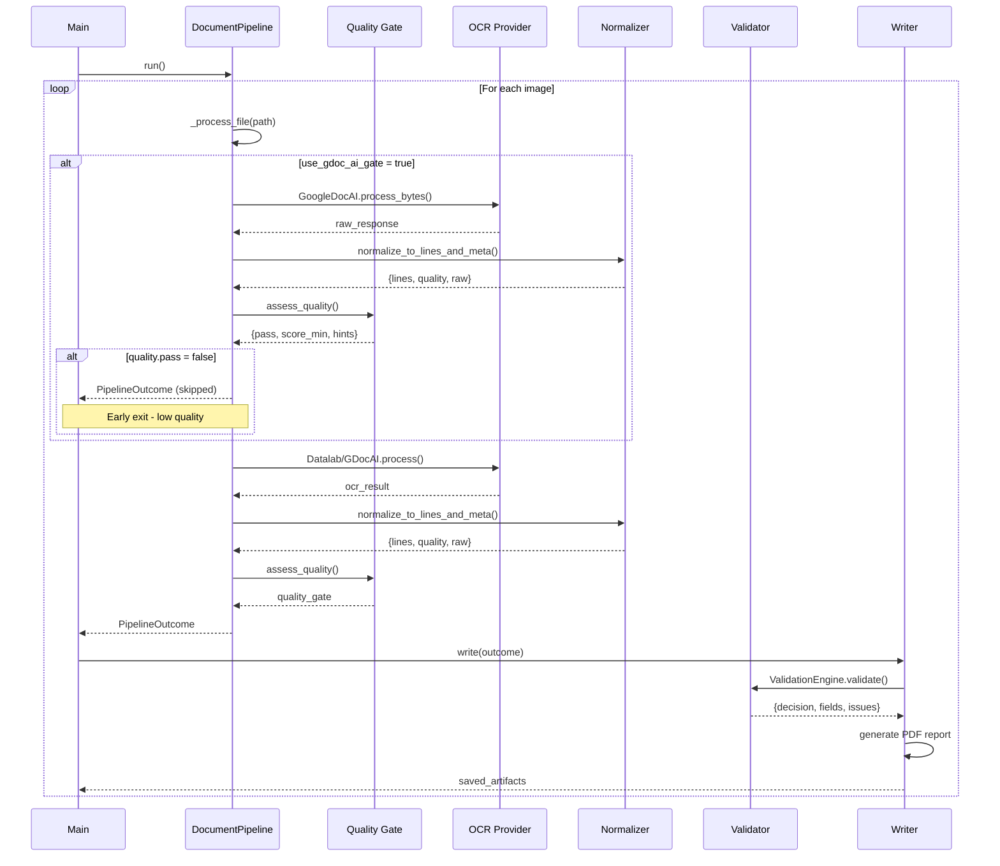

## OCR Proof of Concept

**Author:** Douglas Henrique Siqueira Abreu  
**Company:** Algorithma AI  
**License:** Proprietary - All Rights Reserved

This project evaluates the OCR capabilities offered by **Datalab** and **Google Document AI**, wrapping the APIs in a modular, SOLID-oriented codebase. Multiple execution paths are available:

- `datalab_api` (default): calls the REST endpoint `/api/v1/ocr` and parses the response into structured outputs.
- `openai_api`: converts the image locally and sends it to an OpenAI multimodal model (e.g., `gpt-4o-mini`) for extraction.
- `chandra`: runs the open-source `chandra-ocr` package locally or against a compatible vLLM server when deeper control is required.
- `gdocai` (MVP): integrates with Google Document AI Enterprise Document OCR with quality score enabled for gating and unified extraction.

### Architecture

#### Components



#### Execution Flow



### Prerequisites

- Python 3.12+
- [uv](https://github.com/astral-sh/uv) on your PATH
- Environment variables:
  - `DATALAB_API_KEY`: API key issued by Datalab.
  - `DATALAB_API_BASE`: API base URL (defaults to `https://www.datalab.to/api/v1`).
  - `OPENAI_API_KEY`: required when `PIPELINE_MODE=openai_api`.
  - `GDOC_PROJECT_ID`, `GDOC_LOCATION`, `GDOC_PROCESSOR_ID`: identifiers for the Google Document AI processor (Enterprise Document OCR). See [official documentation](https://cloud.google.com/document-ai/docs/create-processor#documentai_create_processor-python) to create/manage processors.
  - `QUALITY_MIN_SCORE`, `FIELD_MIN_CONFIDENCE`: minimum quality and confidence thresholds applied by the quality gate and validation.
  - `USE_GDOC_AI_GATE`: when `true`, runs the Google quality gate even in `datalab_api` mode before calling "slow" APIs.

### Installation

```bash
uv sync
```

`uv` provisions/updates `.venv` and installs every dependency, including `chandra-ocr` from GitHub.

### Usage

```bash
uv run python main.py [--mode gdocai|datalab_api|chandra|openai_api] [--images-dir <dir>] [--output-dir <dir>] [--use-gate/--no-use-gate]
```

What happens during a run:

- Files from `images_example` (override via CLI `--images-dir` or env `IMAGES_DIR`) are enumerated.
- The selected engine runs unified normalization (`lines`, `quality`, `raw_payload`).
- A quality gate evaluates `QUALITY_MIN_SCORE`; if rejected, returns reasons and guidance (reflection, focus, etc.).
- Heuristic extraction (`date`, `recipient_name`, `signature_present`, `tracking_code`) runs over normalized lines and generates `_validation.json` with decision (`OK`, `NEEDS_REVIEW`, `REJECTED`).
- Artifacts are saved to `outputs/<filename>/` (override via CLI `--output-dir` or env `OUTPUT_DIR`):
  - `<filename>_ocr.json`: normalized payload with latencies, fields, and raw payload.
  - `<filename>_ocr.txt`: human-readable summary (quality, decision, fields, OCR text).
  - `<filename>_validation.json`: structured result from the validation engine.
  - `<filename>_validation.pdf`: PDF report with status, fields, and quality.
  - `<filename>_gdocai_raw.json`: raw Document AI payload (when available) for debugging.

Structured logs with `run_summary file=... mode=... decision=... latencies=...` are emitted to facilitate observability.

### Running with Google Document AI

1. Follow the [official documentation](https://cloud.google.com/document-ai/docs/create-processor#documentai_create_processor-python) to:
   - Enable the `documentai.googleapis.com` API in your project.
   - Create an `OCR_PROCESSOR` or *Enterprise Document OCR* processor in the desired region.
   - Enable [Application Default Credentials](https://cloud.google.com/docs/authentication/provide-credentials-adc) by pointing `GOOGLE_APPLICATION_CREDENTIALS` to the service account JSON.
   - (Optional) List processor types via `fetchProcessorTypes` to validate availability.
2. Fill `.env` with `GDOC_PROJECT_ID`, `GDOC_LOCATION`, `GDOC_PROCESSOR_ID` and set `PIPELINE_MODE=gdocai`.
3. Execute:

```bash
uv run python main.py --mode gdocai
```

During processing, Google's quality gate returns `score_min`, `score_avg`, and suggestions for capture improvement. Default threshold `QUALITY_MIN_SCORE=0.55` (adjust according to SLA).

### Fast-path with Quality Gate + Datalab API

To use Google's quality gate before sending files to Datalab:

```bash
uv run python main.py --mode datalab_api --use-gate
```

If `score_min < QUALITY_MIN_SCORE`, the pipeline returns immediate rejection with reasons (e.g., `motion_blur (0.42)`) and guidance (`Avoid moving the device...`). When approved, the pipeline executes Datalab API and reuses the same validation structure.

### Quick A/B Experiment

The `scripts/ab_compare.py` script runs the same files in multiple modes and generates a CSV with decisions, quality, and latencies:

```bash
uv run python scripts/ab_compare.py --images-dir images_example --modes datalab_api,gdocai --use-gate
```

The CSV is saved to `outputs/ab/ab_compare.csv` and the console displays an aggregated summary (`OK=`, `NEEDS_REVIEW=`, etc.).

### Configuration

Tune behaviour through environment variables:

| Variable | Description |
| --- | --- |
| `PIPELINE_MODE` | Select `datalab_api` (default), `openai_api`, `chandra`, or `gdocai`. |
| `GDOC_PROJECT_ID`, `GDOC_LOCATION`, `GDOC_PROCESSOR_ID` | Google Document AI processor identifiers. |
| `GOOGLE_APPLICATION_CREDENTIALS` | Local path to service account JSON (Application Default Credentials). |
| `QUALITY_MIN_SCORE` | Minimum threshold accepted by quality gate (0 to 1). |
| `FIELD_MIN_CONFIDENCE` | Minimum confidence per required field. |
| `USE_GDOC_AI_GATE` | `true` to run quality gate before sending to Datalab. |
| `API_PAGE_RANGE` / `API_MAX_PAGES` | Restrict pages submitted to `/ocr`. |
| `API_SKIP_CACHE` | Force re-processing when `true`. |
| `API_POLL_INTERVAL_SECONDS` | Polling cadence between status checks (default `2`). |
| `API_MAX_POLL_ATTEMPTS` | Maximum number of status checks (default `60`). |
| `OPENAI_MODEL` | Model used when `PIPELINE_MODE=openai_api` (`gpt-4o-mini` by default). |
| `OPENAI_MAX_TOKENS` | Cap for tokens returned by the OpenAI response (default `1024`). |
| `CHANDRA_INFERENCE_METHOD` | `vllm` (default) or `hf` when using the Chandra path. |
| `INCLUDE_IMAGES` | Persist extracted images in Chandra mode. |
| `MAX_OUTPUT_TOKENS`, `MAX_WORKERS`, `MAX_RETRIES` | Fine-tune Chandra requests. |
| `OUTPUT_DIR` | Directory for generated artefacts. |

### Observations

- REST calls require the `X-API-Key` header; the client inserts it automatically from `.env`.
- The parser layer (backed by Pydantic models) normalises the API response, removes duplicate lines, and produces user-facing summaries.
- Logging runs at `INFO` level, producing structured lines with filename, mode, decision, latencies, and quality scores.
- `gdocai` saves the raw payload (`*_gdocai_raw.json`) when available, facilitating debugging.
- Minimal extraction (`fields.py`) is heuristic: adapt with additional rules or connect a Custom Extractor from Workbench in the future via `GDOC_EXTRACTOR_PROCESSOR_ID`.
- For OpenAI, set `PIPELINE_MODE=openai_api` and export `OPENAI_API_KEY`.

### License

This software is proprietary and confidential. All rights reserved by Algorithma AI.  
Unauthorized copying, modification, or distribution is strictly prohibited.

For licensing inquiries, contact:  
**Douglas Henrique Siqueira Abreu**  
douglas.abreu@algorithma.com.br
